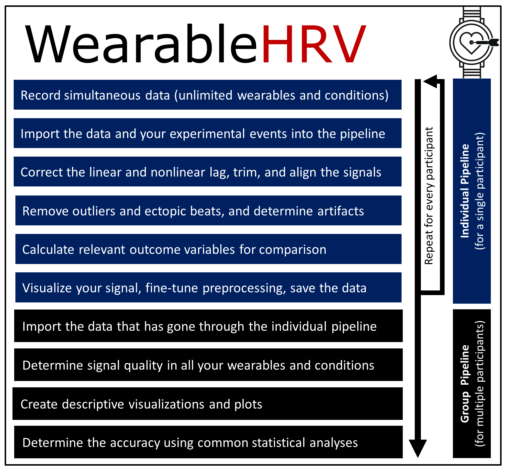
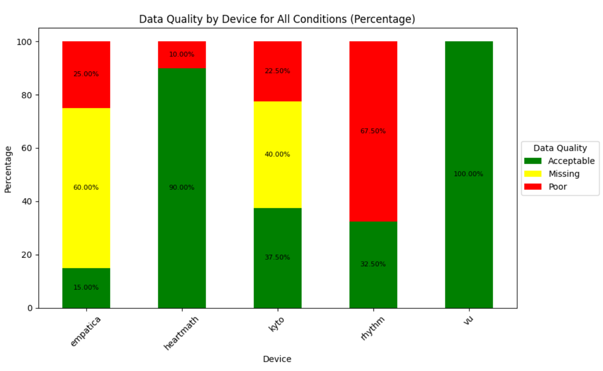

# Summary

Wearable devices that monitor physiology have become ubiquitous, and include smart watches, smart jewellery, and smart textiles. The market for these devices is rapidly expanding with new brands and products. These devices measure a variety of signals, which are translated into a large amount of different features, of which heart rate (HR) and heart rate variability (HRV) are among the most common. These features are particularly interesting, not only for consumers but also for researchers, because they are predictive of mental and physical health outcomes, and easily obtained. However, for manufacturers, there may be a trade-off between user acceptability on the one hand and accuracy on the other, where profit margins typically turn out to be the decisive factor. Therefore, the following question continually comes up: is the cardiac data recorded by this new watch/ring/shirt accurate enough to use in research?

The `WearableHRV` Python package offers a comprehensive pipeline for validating the accuracy of HR and HRV measurements. It allows for advanced statistical analyses on device agreement from beat-to-beat cardiac data. The package's graphical user interface (GUI) facilitates pre-processing, visualization, and data analysis at both individual and group levels. As input, a user of `WearableHRV` should use a criterion device (i.e., a gold standard), preferably an electrocardiograph (ECG). Simultaneously acquired data from the device(s) of interest can then be compared against the criterion. The only required inputs for the pipeline are the inter-beat intervals (IBIs) and timestamps for each device; the rest is fully handled by the `WearableHRV` package.

# Statement of Need

The use of wearables in psychophysiology and sports sciences has exponentially increased over the past decade. While the golden standard is electrocardiography, for prolonged monitoring many studies use devices that measure HR and HRV using Photoplethysmography (PPG). This technique optically measures the changes in blood volume in peripheral tissues (e.g., earlobe, wrist, arm, fingertip) and substitutes detected pulses for the actual contraction of cardiac ventricular muscles [@challoner_photoelectric_1974]. Although the PPG method is promising and versatile, several studies have highlighted concerns about its validity in identifying HR and HRV, especially when the user is in motion [@hill_ethnic_2015;@pinheiro_can_2016;@quintana_guidelines_2016;@nederend_impedance_2017;@allen_photoplethysmography_2007;@schafer_how_2013;@stone_assessing_2021;@bent_investigating_2020].

The oversight regarding the accuracy of these wearables may be due to the lack of an integrated and user-friendly method for assessing the validity of new wearables entering the market. A validation pipeline could lead users from collecting raw data, through pre-processing and advanced statistical analysis, to obtaining the necessary parameters and visualizations required to assess device agreement. The `WearableHRV` package was developed to address this gap. Other existing packages such as `hrv-analysis` [@Champseix2021], `NeuroKit2` [@Makowski2021neurokit], `pyHRV` [@Gomes2019], and similar toolkits offer solutions for pre-processing, analysis, and visualization once IBIs from a single device are provided. However, the added value of `WearableHRV` is rooted in a few key aspects:

First, the currently available packages are not tailored for validation purposes. This becomes especially noticeable when validating multiple wearables at once, across different experimental conditions. This manual process can become a cumbersome task with the packages currently at hand. Second, to make the validation of wearables easier, a user-friendly solution is needed, which current packages lack. This is particularly notable for essential validation steps, such as correcting linear and non-linear lags between devices or trimming signals for a specific device or condition, steps that `WearableHRV` simplifies with GUIs. Third, establishing the validity of a wearable against a gold standard involves numerous decisions. Our pipeline provides a thorough method with extensive documentation for users to do this. The availability of such a pipeline also encourages researchers to contribute to establishing a standardized validation protocol, unifying the approach, reducing variability between methods, and facilitating result comparisons. Finally, the division of the `WearableHRV` pipeline into individual and group pipelines offers an advantage for different types of users. The individual pipeline is designed for processing data from a single participant, whereas the group pipeline offers tools to establish the quality of the signals, device agreement, and validity of the devices across multiple participants. Most common statistical analyses in validation studies, such as mean absolute percentage error, regression analysis, intraclass correlation coefficient (ICC), and Bland-Altman analysis, are already incorporated into the pipeline [@BRUTON200094;@d66d4fe8-8a27-315e-bbce-f72f450c6450;@MAKRIDAKIS1993527;@Haghayegh_2020].

In summary, provided that a wearable device (either PPG or ECG) allows for the export of the complete time series of recorded IBIs, this Python package makes it relatively easy to establish the validity of a novel wearable in just a few steps. The inclusion of GUI in most functions grants researchers and wearable users the flexibility to validate an unlimited number of wearables across a wide range of conditions.

# Main Features and Basic Usage

In this section, we provide an overview of the main functions and basic usage of the `WearableHRV` pipeline. The complete documentation of the API and modules can be found [here](https://wearable-hrv.readthedocs.io/en/latest/). Please also refer to the [README.md](https://github.com/Aminsinichi/wearable-hrv/blob/master/README.md), which provides links to several Jupyter Notebook examples.

The pipeline is divided into two parts: the individual pipeline, which focuses on the data from a single individual, and the group pipeline, which combines the data from all the participants in a single study.

## Individual pipeline

The individual pipeline allows for the validation of a wearable of interest against a criterion device (e.g., a gold-standard ECG) under different conditions. Data necessary for the pipeline should be in a .csv file with UNIX timestamps (specified in milliseconds) and IBIs, in two separate columns. Next, experimental conditions need to be defined using the `define_events` function. The `import_data` function is then used to bring the continuous time series from all devices into the pipeline. Data segmentation into smaller, condition-specific chunks is achieved with the `chop_data` function.

One of the primary strengths of `WearableHRV` is the `visual_inspection` function with the assistance of the GUI, which allows for simultaneous visualization of IBIs and addresses the challenge of correcting devices' lag when wearables' internal clocks are not in sync. 

Pre-processing and feature extraction with the `pre_processing` and `data_analysis` functions use the `hrv-analysis` python package functionalities [@Champseix2021], and output numerous time domain and frequency domain features for each condition and device. To facilitate comparing the criterion device with the device of interest and visualization of results, several plotting functions are provided, including `result_comparison_plot`, `bar_plot`, `line_plot`, `radar_plot`, and `unfolding_plot`. All time and frequency features for every device and condition can be exported for later use in the group pipeline via the `save_data` function.

## Group pipeline

Moving to group-level analysis, the `import_data` function of the group pipeline aggregates .csv output files that have gone through the individual pipeline. 

An important step in wearable validation is quantifying signal quality, which the `signal_quality` function allows for labeling as poor, missing, and acceptable based on specified criteria by users. The results can be visualized through two functions: `signal_quality_plot1` and `signal_quality_plot2`.

For visualization across the aggregated dataset, the group module offers `violin_plot`, `box_plot`, `radar_plot`, `hist_plot`, and `matrix_plot`.

Finally, `WearableHRV` allows for detailed comparison between each condition and device against the criterion, using the most commonly used statistical analyses: mean absolute percentage error, regression analysis, ICC, and Bland-Altman analysis through the `mape_analysis`, `regression_analysis`, `icc_analysis`, and `blandaltman_analysis` functions. These analyses are complemented with intuitive plots that establish the validity of the wearables.

# Acknowledgements

This study is an output of the ALIVE project (Improving Adolescent mentaL health by reducing the Impact of PoVErty). This work was supported by the Wellcome Trust [221940/Z/20/Z]. We acknowledge contribution from Dr. Denise J. van der Mee and advice from Dr. Marco Altini.

# References
