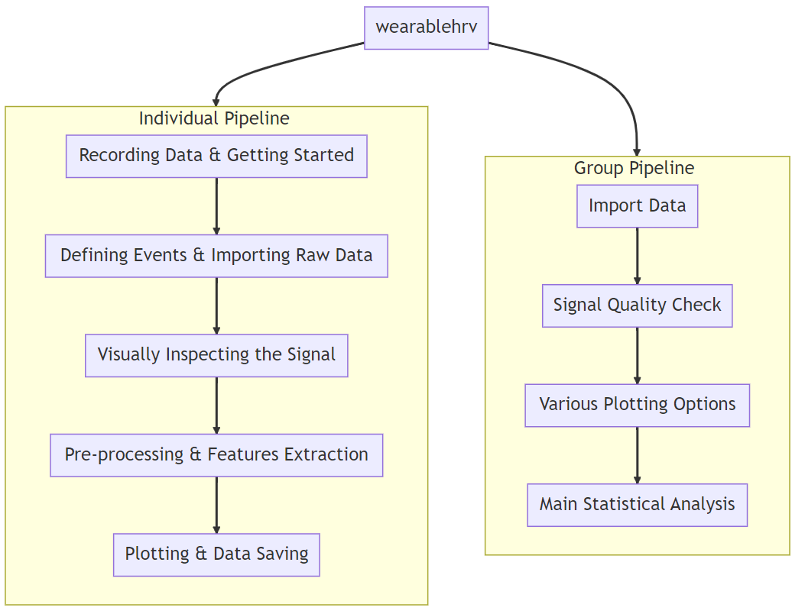

<!-- Your paper should include:

We also require that authors explain the research applications of the software. The paper should be between 250-1000 words. Authors submitting papers significantly longer than 1000 words may be asked to reduce the length of their paper.

A list of the authors of the software and their affiliations, using the correct format (see the example below).
A summary describing the high-level functionality and purpose of the software for a diverse, non-specialist audience.
A Statement of need section that clearly illustrates the research purpose of the software and places it in the context of related work.
A list of key references, including to other software addressing related needs. Note that the references should include full names of venues, e.g., journals and conferences, not abbreviations only understood in the context of a specific discipline.
Mention (if applicable) a representative set of past or ongoing research projects using the software and recent scholarly publications enabled by it.
Acknowledgement of any financial support. -->

# Summary

Wearable devices that monitor physiology have become ubiquitous, and include smart watches, smart jewelry, and smart textiles. The market for these devices is rapidly expanding with new brands and products. These devices measure a variety of signals, which are translated into a large amount of different features, of which heart rate (HR) and heart rate variability (HRV) are among the most common. These features are particularly interesting , not only for consumers but also to researchers, because they are predictive of mental and physical health outcomes, and easily obtained. However, for manufacturers there may be a trade-off between user acceptability on one hand and accuracy on the other, where profit margins typically turn out to be the decisive factor. Therefore the following question continually comes up: is the cardiac data recorded by this new watch/ring/shirt accurate enough to use in research?

The `wearablehrv` Python package offers a comprehensive pipeline for validating the accuracy of HR and HRV measurements. It allows for advanced statistical analyses on device agreement from beat-to-beat cardiac data. The package's graphical user interface facilitates pre-processing, visualization, and data analysis at both individual and group levels. As input, a user of `wearablehrv` should use a criterion device, preferably an electrocardiograph (ECG). Simultaneously acquired data from the device(s) of interest can then be compared against the criterion. The only required inputs for the pipeline are the inter-beat intervals (IBIs) and timestamps for each device; the rest is fully handled by the `wearablehrv` package.

# Statement of Need

The use of wearables in psychophysiology and sports sciences has exponentially increased over the past decade. While the golden standard is electrocardiography, for prolonged monitoring many studies use  devices which measure HR and HRV using Photoplethysmography (PPG). This technique optically measures the changes in blood volume in peripheral tissues (e.g., earlobe, wrist, arm, fingertip) and substitutes detected pulses for the actual contraction of cardiac ventricular muscles[@challoner_photoelectric_1974]. Although the PPG method is promising and versatile, several studies have highlighted concerns about its validity in identifying HR and HRV, especially when the user is in motion [@hill_ethnic_2015;@pinheiro_can_2016;@quintana_guidelines_2016;@nederend_impedance_2017;@allen_photoplethysmography_2007;@schafer_how_2013;@stone_assessing_2021;@bent_investigating_2020].

The oversight of these wearables' validity may stem from the absence of an integrated and user-friendly way to assess the validity of novel wearables. A validation pipeline would guide users from raw data collection through pre-processing and advanced statistical analyses to arrive at the necessary parameters and visualizations necessary to assess device agreement. The `wearablehrv` package was developed to address this gap. Provided that a wearable device (either PPG or ECG) allows for export of the complete time series of recorded IBIs, this Python package makes it relatively easy to establish the validity of a novel wearable in just a few steps. In summary, `wearablehrv` is a Python package tailored for data preparation, pre-processing, feature extraction, comparison, visualization, and both individual and group statistical analyses of heart rate and heart rate variability metrics from wearable devices that transmit raw IBIs and timestamps. The inclusion of graphical user interfaces (GUI) in most functions grants researchers and wearable users the flexibility in validating an unlimited number of wearables across a range of conditions.

# Main Features and Basic Usage

In this section, we provide an overview of the main functions and basic usage of the `wearablehrv` pipeline. For detailed documentation of all the functions and examples on data recording and initiating validation, please refer to [README.md](https://github.com/Aminsinichi/wearable-hrv/blob/develop/README.md) and [documentation.ipynb](https://github.com/Aminsinichi/wearable-hrv/blob/develop/notebooks/documentation.ipynb).

The pipeline is divided into individual and group pipelines to cater to single-individual data and combined data from a study, respectively.

The individual pipeline allows for the validation of a wearable of interest against a criterion device (e.g., an ECG) under unlimited conditions. Data necessary for the pipeline should be in a .csv file with UNIX timestamps (specified in milliseconds) and IBIs, in two separate columns. For defining events and importing recorded data, the pipeline can be initiated with the `define_events` function, either by referencing a pre-specified .csv file or by using the GUI. The `import_data` function is then used to bring the continuous time series from all devices into the pipeline. Data segmentation into smaller, condition-specific chunks is achieved with the `chop_data` function.

One of the primary strengths of `wearablehrv` is the `visual_inspection` function, which allows for simultaneous visualization of IBI signals and addresses the challenge of correcting devices lag when their internal clocks are not in sync. With the assistance of the GUI, adjusting for this lag becomes straightforward.

Pre-processing and feature extraction are streamlined using the `pre_processing` function and the `data_analysis` function from the `hrv-analysis` python package[@Champseix2021], outputting time domain and frequency domain features for all devices and conditions.

To facilitate comparing the criterion device with the device of interest and visualization of results, several plotting functions are provided, including `result_comparison_plot`, `bar_plot`, `line_plot`, `radar_plot`, and `unfolding_plot`. All time and frequency features for every device and condition can be exported for later use in the `Group Pipeline` via the `save_data` function.

Moving to group-level analysis, the `import_data` function of the group module aggregates individual case analyses. A significant advancement in wearable validation is the ability to identify the amount of missing, poor and acceptable data in each device, and generate detailed reports. The `signal_quality` function allows for such signal quality assessment across devices and participants, providing detailed reports for informed decision-making.

For visualization across the aggregated dataset, the group module offers `violin_plot`, `box_plot`, `radar_plot`, `hist_plot`, `matrix_plot`, and `density_plot`.

The culmination of the group pipeline involves the main statistical analyses — regression analysis, ICC, and Bland-Altman analysis — enabled by the `regression_analysis`, `icc_analysis`, and `blandaltman_analysis` functions, respectively. These are complemented by their corresponding plotting functions, allowing for a detailed and visual validation of the wearable devices against the criterion device.

# Acknowledgements

We acknowledge contribution from Dr. Denise J. van der Mee and advices from Dr. Marco Altini.

# References
